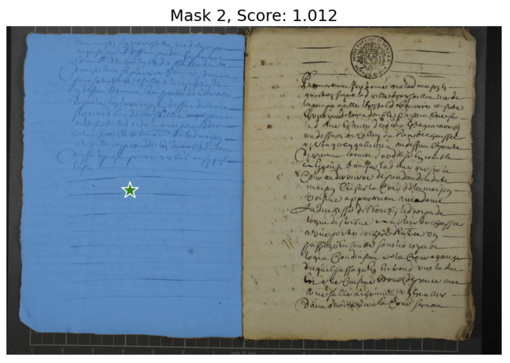
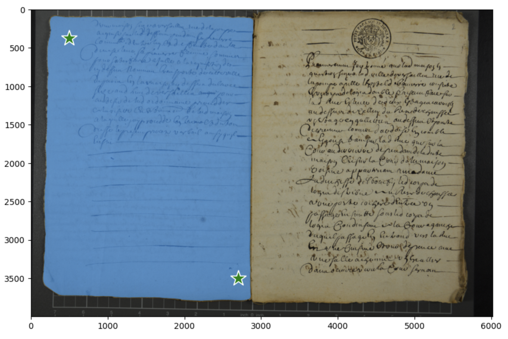
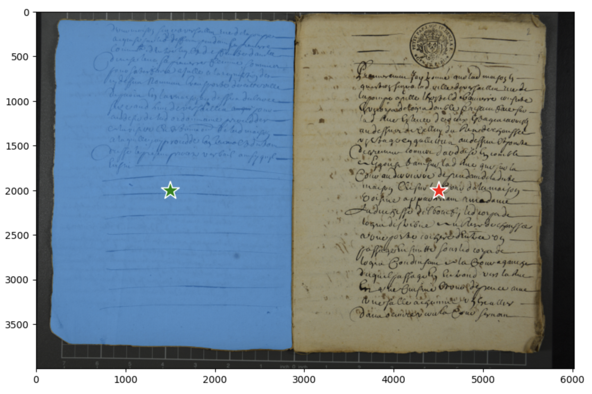
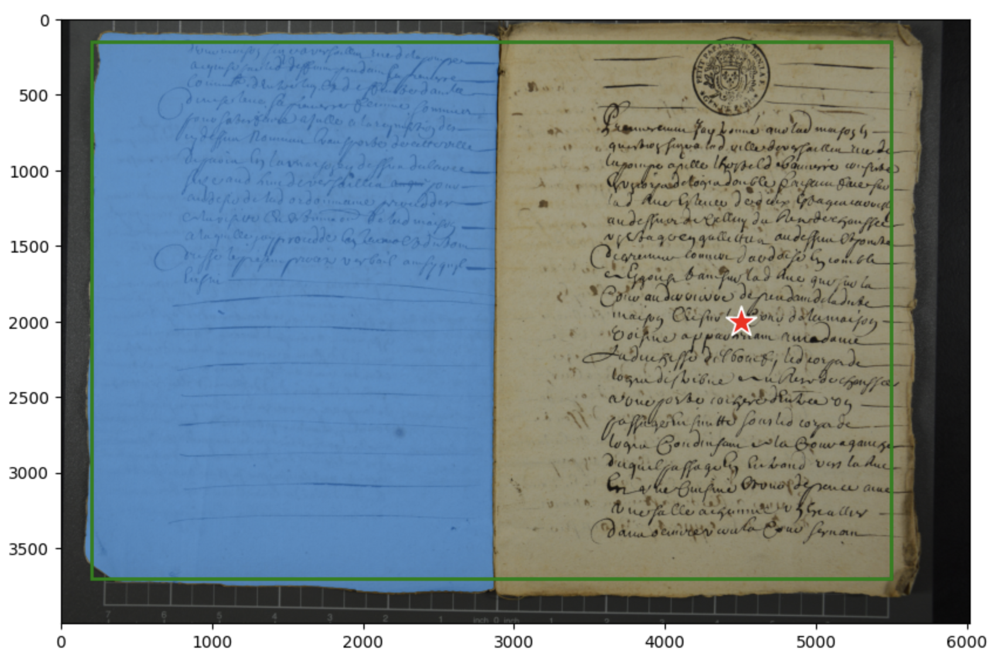
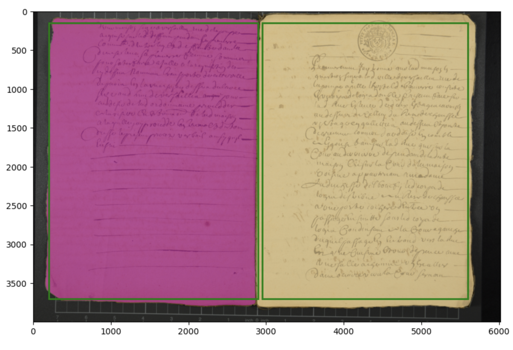
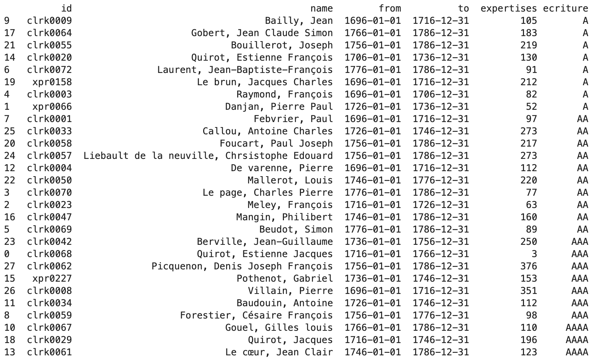
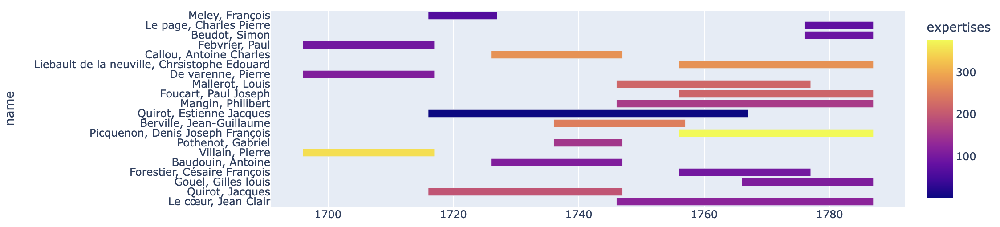
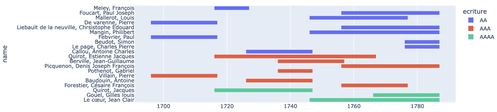
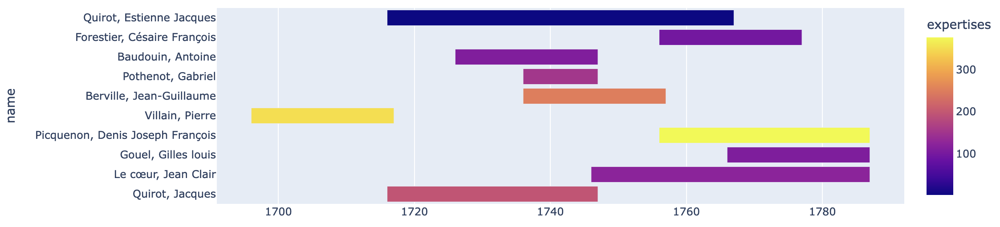
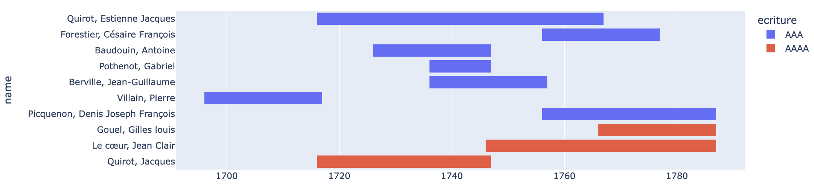

# Journal du projet À dire d’experts

## 22 décembre 2023
- **ANR** révision des scripts pour l'importation des réceptions et des IAD. Le rapatriement est quasi prêt, il reste à voir quelques éléments avec RC cf [issue#35](https://github.com/anrExperts/data/issues/35).
- État des transcriptions : 17 expertises transcrites et encodées en TEI (soit 42f.) : 432d001 ; 433d068, d110 ; 434d067, d083, d122 ; 480d058 ; 481d050 ; 482d049 ; 483d033 ; 484d022, d035 ; 526d059 ; 527d062 ; 528d024 ; 663d036 ; 664d017.
- notre demande d'accès à la ferme de calcul IN2P3 a été acceptée.

## 21 décembre 2023
- Lectures sur Yolo et nouvelle tentative d'installation (le précédent notebook portait en réalité sur une application vidéo)
- Présentation des premiers résultats de segmentation avec SA à EC et nouvelle tentative d'utiliser le mode automatique (installation des drivers CUDA notamment), mais après lecture de la documentation fournie par Huma-num, la carte graphique de la ferme de calcul niveau 1 est bridée, ce qui pourrait expliquer les erreurs que nous avons :
> Les GPU Nvidia A100 sont partitionnés via MIG, par conséquenc il n’est pas possible d’utiliser les bibliothèques graphique (Vulkan, DirectX, OpenGL). Chaque compte ne peut accéder qu’à une fraction de la GPU.
- On s'orienterait donc vers l'utilisation de SA, mais il faut attendre la réponse d'Huma-num pour l'accès à l'IN2P3.

## 19 décembre 2023
- Test du mode automatique de SA
  - malheureusement, ce mode est trop gourmand en ressources pour s'exécuter avec la version gratuite de Google Colab et peu un importe le modèle de données utilisé (`B`, `L` ou `H`).
  - la ferme de calcul niveau 1 d'Huma-num dispose bien d'une carte graphique NVidia A100 compatible `CUDA` (nécessaire pour SegmentAnything). Mais impossible d'exécuter le script…

## 18 décembre 2023
- Poursuite du travail sur SegmentAnything. 
  - SA propose deux modes de fonctionnement :
    - Predictor : l'utilisateur détermine lui même ce qu'il recherche (ou ce qu'il ne veut pas) par l'intermédiaire de pointeurs ou de box
    - Automatic mask générator : SA détect automatiquement les objets sur une image.
  - 3 modèles (SAM) différents peuvent être chargés `vit_B`, `vit_L`, `vit_H`. Les modèles sont vraisemblablement les mêmes sauf ce qui concerne la taille du réseau de neuronne. `B` = "base" ; `L` = "large" ; `H` = "huge". `H` est plus performant que `B`, mais `L` offre tout de même de bons résultats tout en étant plus léger… Le choix dépend donc plus de la puissance de calcul disponible.
    - En revanche, il semble difficile d'effectuer du *fine tuning* avec SAM. Les modèles ayant été entrainés avec une grande quantité de données, il en faudrait d'autant plus pour le fine tuné…
- Les premiers résultats avec le predictor sont encourageants, avec l'utilisation de `vit_H` SA a retrouvé à chaque fois les feuillets demandés, peu importe la méthode employée :
  - point unique 
  - points multiples  
  - points multiple avec exclusion  
  - boite  
  - boite et point d'exclusion 
  - boites multiples  
- Le notebook annoté est sur Google Drive : `EXPERTS/Colab Notebooks/segmentAnything_predictor_example.ipynb`

## 6 décembre 2023
- test de [segment-anything](https://github.com/facebookresearch/segment-anything) et [Yolo](https://github.com/RizwanMunawar/yolov7-segmentation). Les deux reposent sur CUDA (nécessitent donc des cartes Nvidia).
  - Segment Anything : 
    - installation sur macbook : echec
    - installation sur le serveur de calcul interactif mutualisé d'Huma Num (qui dispose d'un GPU Nvidia) : échec (au niveau de CUDA, problème de drivers je pense…)
    - fonctionne sur Google Collab
  - Yolo
    - installation sur le serveur de calcul interactif mutualisé d'Huma Num : échec. Dans un premier temps, problème causé par la version des packages `torch`, `torchevision`, downgrade vers `Torch 2.0.1` et `Torchevision 0.8.1` règle une partie du problème pas tout ([cf issue sur pytorche](https://github.com/pytorch/pytorch/issues/111469)).

## 5 décembre 2023
- **ANR** ajout d'un submodule dans le repo Data pour le schema EAC et ajout des `<descriptiveNotes/>` dans les `<chronItem/>`
- **ANR** reprise des fichiers EAC-CPF pour la validation [issue #45](https://github.com/anrExperts/data/issues/45)
- notre demande d'accès à CREMMA a été acceptée, nous avons accès à une instance eScriptorium.

## 4 décembre 2023
- **ANR** Ajout de la documentation sur le formulaire dans le schéma Z1J
- **ANR** validation des fichiers EAC-CPF

## 24 novembre 2023
- **ANR** finalisation du schema Z1J

## 22 novembre 2023
- demande d'accès au serveur de calcul IN2P3
- **ANR** poursuite de la rédaction du schéma Z1J

## 20 novembre 2023
- **ANR** reprise du schéma Z1J en pure ODD (suppression des règles relaxNG) et début du travail sur les règles schematron

## 31 octobre 2023
- Poursuite des transcriptions
- Z1J 434_0589 : deux mains différentes, Villain qui débute puis certainement Quirot, puis de nouveau Villain. La main fatigue au fil du pv. Deux abréviations rencontrées qui ne sont pas faciles à transcrire (un commentaire a été laissé à chaque fois).
- corrections fiches prosopo et formulaire (vocabulaire Ric-O)
- début rédaction odd xpr

## 30 octobre 2023
- Poursuite des transcriptions
- Première proposition de [normes de transcriptions](https://github.com/anrExperts/adire/issues/6#issuecomment-1785794335)
- Kraken : semble fonctionner, en partie, avec python 3.10 sur macOs, mais uniquement pour la segmentation, toujours impossible de charger un modèle de transcription ou de segmentation.

## 20 octobre 2023
- Kraken : tentative d'installation sur macOs avec pip et conda (très long avec ce dernier) : échec. Ne semble pas fonctionner avec python 3.12

## 19 octobre 2023
- Travail sur les particularités des mains (abréviations, ponctuation, accentuation, etc.)
- Tableau comparatif des règles de transcription (Arianne Pinche, Maxime Gohier, Bernard Barbiche)
- Dépôt de la candidature [Cremma](https://cremmacall.sciencescall.org/)
- Installation de [Kraken](https://kraken.re/main/index.html)
  - Difficultés rencontrées pour l'installation de Kraken, puis pour l'installation d'un modèle de reconnaissance de texte (problèmes non résolus pour l'heure) (Ubuntu)
  - La segmentation fonctionne (modèle std BLLA) et ne semble effectivement pas très gourmande en ressource
    - sorties testées json et alto
    - outil de visualisation pour segmentation alto [https://github.com/emory-lits-labs/altoviz](https://github.com/emory-lits-labs/altoviz) - [http://emory-lits-labs.github.io/altoviz/](http://emory-lits-labs.github.io/altoviz/)

## 17 octobre 2023
- Rédaction du dossier pour accès CREMMA et instance eScriptorium

- Lecture du compte-rendu du rdv avec Alix et du Guide de la transcription d'Ariane Pinche :
  - segmentation des mots : "pardevant" (Villain) = "par devant"
  - retrait des majuscules : "parLaquelle" (Quirot) = "par laquelle"
  - les abréviations ne doivent pas être développées : "observaõn" (Quirot) 

- Recherche d'autres règles de transcription utilisées par des projets HDR et des corpus de textes modernes pour obtenir un panorama :
  - Le projet "Crimes et châtiments" a par exemple fait le choix de développer les abréviations puis de les mettre en notes dans Transkribus pour obtenir un corpus différent (cf. Élodie Paupe. ENC. (2022, 23 juin). 1.4 : Une cursive du 17e siècle , in Documents anciens et reconnaissance automatique des écritures manuscrites. [Vidéo]. Canal-U. [https://www.canal-u.tv/133333].)
  - Les Gardenotes qui propose des règles de transcription de corpus de textes période moderne [https://lesgardenotes.org/kb/regles-de-transcription/]
  - Theleme (ENC) et les Conseils pour l’édition des textes de l’époque moderne (XVIe-XVIIIe siècle) par Bernard Barbiche [http://theleme.enc.sorbonne.fr/cours/edition_epoque_moderne/edition_des_textes]

- Début de rédaction d'un tableau comparatif des règles de transcription entre Ariane Pinche, Maxime Gohier et Bernard Barbiche cf [issue 6](https://github.com/anrExperts/adire/issues/6)

- Tableaux récapitulatifs sur la sélection des greffiers ([données et commentaires](https://docs.google.com/spreadsheets/d/e/2PACX-1vQ6vEqexLuojIOKkZC8B8dhmzbV0MF6-dGOcczVKZMEZb3TPJODYsGeDU4AG33kzAP4stp1-z6a8MF0/pub?gid=313988877#))

Présélection des greffiers disposant d'un corpus d'expertises important et susceptible de couvrir une longue période :

Frise chronologique greffiers / nombre d'expertises (écriture AA et +)

Frise chronologique greffiers / qualité d'écriture (écriture AA et +)

Frise chronologique greffiers / nombre d'expertises 2 (écriture AAA et +)

Frise chronologique greffiers / qualité d'écriture 2 (écriture AAA et +)

## Réunion IERDJ, 16 octobre 2023 : Josselin, Sara, Emmanuel, Robert

### Discussion sur l’évaluation statistique

- Les recherches sur la sélection des mains ont été faites avec Jupiter. Les médianes, etc. on été calculées avec XQuery.
- Pour le NLP on va sans doute travailler avec Julia avec des appels de fonction en Python au besoin.

Environnement de travail

Pour la reconnaissance d’écriture ou la segmentation, on aura probablement besoin de faire tourner des modèles de deep learning. Il sera sans doute nécessaire d’avoir accès des GPU pour entraîner des modèles. Voir avec HumaNum ou Calcul Québec.
communication à Alix des informations sur les écritures

## Organisation du travail

Drive ou blog. Créer un lab dans le cadre du projet
Carnet de laboratoire, chaque jour prendre 10 minutes
Blogs plus ponctuels : par exemple sur la reconnaissance des écritures.

## Segmentation

Discussion des solutions possibles pour la segmentation : cf. [issue 4](https://github.com/anrExperts/adire/issues/4)

## Rdv Alix Chagué

### Collaboration avec CREMMA

Comme le projet est mené en France, il est éligible pour disposer d’un compte sur Cremma.
https://cremmacall.sciencescall.org/

--> [issue 5](https://github.com/anrExperts/adire/issues/5)

Pour formaliser une collaboration avec Almanach au-delà de la simple participation à CREMMA, il est possible d’écrire à Benoît Sagot et à Laurent Romary.

eScriptorium fonctionne actuellement encore sur le serveur Traces6. Il devrait bientôt basculer vers le nouveau serveur CREMMA.

Il peut y avoir des limites concernant l’utilisation du serveur. Notre projet présente le dimensionnement suivant :
- 60 000 vues au total
- Si choix d’un nombre limité de greffier : 1 173 expertises (circa 6 000 photos)
- limite de stockage prévue sur CREMMA c. 20 000

Appliquer un modèle de reconnaissance n’est pas coûteux en GPU, c’est l’entraînement du modèle qui est coûteux.

L’entraînement ne fonctionnent pas actuellement sur Traces6. Cela devrait fonctionner sur CREMMA d’ici la fin de l’année. En attendant, il est toujours possible d’utiliser eScriptorum pour faire l’annotation et de passer en local pour entraîner un modèle avec Kraken.

### Discussion sur la chaîne de segmentation

Alix nous recommande la pré-annotation et la détection des zones dans Kraken. Il est toutefois possible de segmenter au préalable pour travailler sur des pages uniques.

Le logiciel [ScanTaylor](https://scantailor.org) peut s’avérer utile pour cette tâche. Il présente l’inconvénient de générer des images très lourdes, mais l’assistant de détection des images fonctionne bien. La sortie est en 600dpi binarisé alors que l’on n’a pas nécessairement besoin de cette résolution ou d’une binarisation. Il est possible d’obtenir une sortie couleur. C’st une solution possible mais longue.

Il pourrait égaleemnt Possible entraîner un modèle YOLO pour faire des rectangles (dépend rectilignité). 20 pages facile à entraîner. Fait des rectangles.

Si la segmentation est gratuite, la tâche pourraît également être réalisée dans Transkribus.

Regarder si on peut utiliser SegmentAnything ?

Alix avait fait des essais avec DhSegment en 2019. À l’époque, l’outil n’était pas très bien documenté et elle n’avait pas toutes les connaissances nécessaires pour y travailler.

Voir également les outils développés dans le cadre du projet OCR4All https://github.com/OCR4all/LAREX ou encore « Eynollah ». (2020) 2023. Python. QURATOR-SPK. https://github.com/qurator-spk/eynollah.

Même si c’est un investissement en temps important, il peut être intéressant de passer suffisamment de temps préalable sur la préparation de la segmentation. La segmentation préalable du corpus pourrait également présenter l’intérêt de repérer les éléments graphiques ou d’autres phénomènes.

Dans eScriptorium le modèle de segmentation BLLA (le modèle par défaut) fonctionne bien. Malheureusement, les métriques pour la performance des modèles sont unitaires. Elles permettent pas de distinguer les lignes, les régions et le typage des régions. Par ailleurs, le calcul a lieu au niveau des pixels alors que cette précision n’est pas nécessaire. Mieux vaut tester et voir comment cela fonctionne.

Toutefois, il est possible de segmenter avec Blla et de typer les zones. Il faut alors identifier un corpus de segmentation qui présente suffisamment de diversité et de complexité par rapport au corpus que l’on souhaite segmenter. Comme c’est coûteux de faire de la segmentation, il est tentant de vouloir l’utiliser pour la transcription mais il peut s’avérer nécessaire d’en faire une tâche spécifique.

### Repérage des mains et règles de transcription

Voir le Guide de transcription mis au point par Arianne Pinche
https://hal.science/hal-03697382/document

Un premier test réalisé avec le modèle HTR-Unites-Manu McFrench V3 donne des résultats encourageants. Cela devrait bien fonctionner en transcrivant relativement peu de pages.

Présentation à Alix du travail fait sur  le repérage des écritures. Alix signale une thèse sur la caractérisation des écritures. https://helios2.mi.parisdescartes.fr/~vincent/siten/Publications/theses/pdf/Siddiqi.pdf

Sur la question des indices visuels. Niveaux d’analyse : mise en page, ligne, charactère. Les informations déjà rassemblées pourraient lui être utile. Elle réfléchit à des critères qui pourraient être repérés.

### Collaboration possible avec Alix Chagué

Alix confirme qu’il pourraît être intéressant pour elle d’être formellement associée au projet. Afin de limiter le temps de sollicitation, on prévoit d’isoler les questions de transcriptions et d’identification des mains pour les traiter dans des réunions distinctes.

## Utilisation de ce document

Ce fichier est un journal pour le suivi quotidien du travail réalisé dans le cadre du projet *À dire d’experts*. Chaque jour, faire le compte-rendu du travail réalisé en relevant les points éventuellement problématiques qui devront être discutés en signalant les issues GitHub qui sont créées à ce sujet. Plutôt que dans ce document, on privilégie les discussions dans les issues afin de pouvoir les catégoriser avec des mots-clefs et en faire un suivi approprié.
